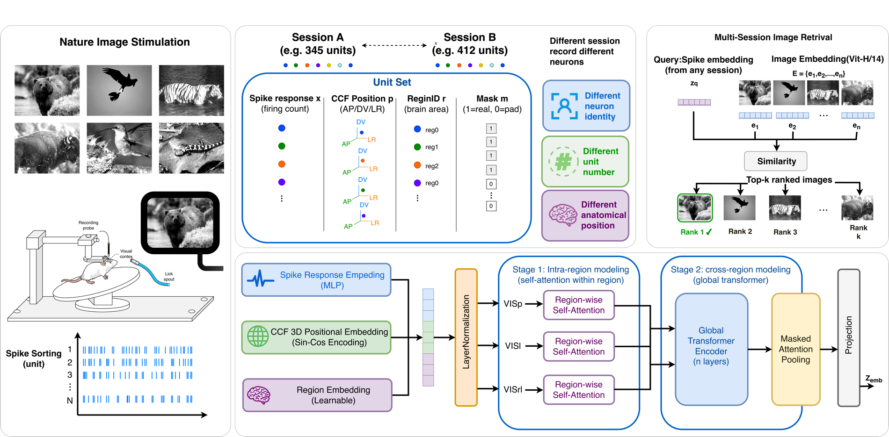

<div align="center">

# SOPHON

**SOPHON: Spatially Organized Population Heterogeneity of Neural Unit Tokens<br>
for Multi-Session Cortical Image Retrieval**

Shaocheng Ma<sup>†</sup>, Mingliang Xu<sup>†,\*,‡</sup>, Guoxin Zhang, Xialu Chen, Yifei Jiang, Lei Ye, and Fei He<sup>\*</sup><br>
SiClink


<sup>†</sup> Equal contribution. <sup>\*</sup> Corresponding authors. <sup>‡</sup> Project lead.

</div>

SOPHON aligns variable, session-specific cortical spike populations with CLIP image embeddings, enabling natural image retrieval without matching neural units across recording sessions.

<p align="center">
  
</p>

<p align="center">
<em>Overview of SOPHON: anatomical unit tokenization, region-wise attention, global population interaction, and CLIP-aligned image retrieval.</em>
</p>

## Contents

<p align="center">
  <a href="#overview">Overview</a> |
  <a href="#method">Method</a> |
  <a href="#main-results">Results</a> |
  <a href="#installation">Installation</a> |
  <a href="#quick-start">Quick Start</a> |
  <a href="#data">Data</a> |
  <a href="#training">Training</a> |
  <a href="#citation">Citation</a> |
  <a href="#contact">Contact</a>
</p>

## Overview

SOPHON is a neural-to-image retrieval framework for decoding natural image identity from mouse cortical spike recordings. It addresses a practical multi-session setting where each recording contains a different set of neural units, making direct unit correspondence unavailable.

The core idea is to represent each unit as an anatomical token that combines spike activity, CCF coordinates, and visual-area identity, then model heterogeneous variable-size neural populations in a shared embedding space aligned with image features.

> The name **SOPHON** evokes the sophon from Liu Cixin's novel *The Three-Body Problem*: a microscopic unit carrying dense information. Here, each spike-sorted unit becomes a spatially organized anatomical token that bridges cortical spikes and visual representations.

## Method

SOPHON models population heterogeneity through neural unit tokens: it learns a shared neural-to-visual representation from session-specific unit populations without requiring unit identity matching across recordings.

The model has four main stages:

1. Anatomical unit tokenization: each selected unit is represented by normalized spike activity, a CCF coordinate embedding, and a visual-area embedding.
2. Region-wise unit attention: units from VISp, VISl, and VISrl are first processed within their respective cortical areas.
3. Global unit attention: all real units interact across areas to capture broader population structure.
4. Masked attention pooling: variable-length unit sets are aggregated into a fixed-dimensional neural embedding aligned with CLIP image features.

## Main Results

Results use image-level centroid retrieval and report mean per-class Top-k accuracy across image identities, with values shown as mean ± standard deviation over five independent runs.

SOPHON achieves mean per-class Top-1 accuracy of **100.00 ± 0.00%** and mean per-class Top-5 accuracy of **100.00 ± 0.00%** when spike responses, CCF coordinates, unit identity, and visual-area identities are used.

Coordinates, visual-area identities, and unit identity improve retrieval when paired with spike responses. Spike + CCF + Region uses spike response, session-wise normalized CCF coordinate encoding, and visual-area identity; SOPHON additionally uses unit identity. Shuffled CCF denotes a within-session permutation of the coordinates.

| Setting | Spike | CCF | Shuffled CCF | Unit Identity | Region | Mean per-class Top-1 (%) | Mean per-class Top-5 (%) | Mean per-class rank |
|---|:---:|:---:|:---:|:---:|:---:|---:|---:|---:|
| Spike only | ✓ |  |  |  |  | 8.98 ± 1.98 | 26.95 ± 1.46 | 20.880 ± 2.958 |
| Spike + Region | ✓ |  |  |  | ✓ | 83.90 ± 2.51 | 96.78 ± 1.46 | 1.476 ± 0.063 |
| Spike + Shuffled CCF | ✓ |  | ✓ |  |  | 59.49 ± 7.34 | 86.27 ± 4.59 | 3.049 ± 0.569 |
| Spike + Shuffled CCF + Region | ✓ |  | ✓ |  | ✓ | 96.44 ± 1.46 | 100.00 ± 0.00 | 1.056 ± 0.032 |
| Spike + CCF | ✓ | ✓ |  |  |  | 97.46 ± 0.93 | 99.66 ± 0.42 | 1.056 ± 0.029 |
| Spike + CCF + Region | ✓ | ✓ |  |  | ✓ | 97.80 ± 1.95 | 100.00 ± 0.00 | 1.025 ± 0.021 |
| Spike + Unit Identity | ✓ |  |  | ✓ |  | 99.32 ± 0.63 | 100.00 ± 0.00 | 1.008 ± 0.008 |
| Spike + CCF + Unit Identity | ✓ | ✓ |  | ✓ |  | 99.83 ± 0.34 | 100.00 ± 0.00 | 1.002 ± 0.003 |
| **SOPHON** | ✓ | ✓ |  | ✓ | ✓ | **100.00 ± 0.00** | **100.00 ± 0.00** | **1.000 ± 0.000** |

## Installation

Create a Python environment and install the project dependencies:

```bash
pip install -r requirements.txt
```

Use a CUDA-enabled PyTorch build if GPU training is required.

## Quick Start

Run training from the repository root:

```bash
python main.py \
  --data-dir data/selected_sessions \
  --feature-file resources/extracted_features.pt \
  --save-root runs \
  --epochs 100 \
  --batch-size 64 \
  --frames-per-batch 72 \
  --trials-per-frame 1
```

## Data

The project uses natural-scene stimuli and extracellular electrophysiology recordings from the [Allen Brain Observatory Visual Coding Neuropixels dataset](https://allensdk.readthedocs.io/en/latest/visual_coding_neuropixels.html).

Training expects preprocessed session files in one directory. Each file must be named:

```text
<session_id>_selected.npz
```

Example:

```text
data/selected_sessions/
├── 715093703_selected.npz
├── 721123822_selected.npz
└── 743475441_selected.npz
```

Each session file must contain:

- `spike_count`: firing-count matrix with shape `[num_trials, num_units]`
- `labels`: natural-image labels with shape `[num_trials]`
- `ccf`: unit CCF coordinates with shape `[num_units, 3]`
- `region`: visual-region name for each unit with shape `[num_units]`

The preprocessing utilities in `nwb_select/` are used as follows:

- `ecephys_allsession_check.py`: inspect raw NWB sessions and print unit counts.
- `session_select_all.py`: apply session/unit filtering criteria and export selected `.npz` files with logs.
- `select_session_ccf_check.py`: check CCF completeness before training.

## Image Feature Bank

Training also requires a PyTorch feature file, for example:

```text
resources/extracted_features.pt
```

The image features must form a two-dimensional tensor with shape:

```text
[num_images, embedding_dim]
```

The loader accepts either:

- a tensor containing image features directly, or
- a dictionary containing one of `image_features`, `img_features`, `img_features_all`, `clip_image_features`, or `features`.

Optional text features are accepted from `text_features`, `text_features_all`, or `clip_text_features` when they have the same shape as the image features. If text features are absent or shape-incompatible, training uses image features only.

## Training

The full training command is:

```bash
python main.py \
  --data-dir data/selected_sessions \
  --feature-file resources/extracted_features.pt \
  --save-root runs \
  --epochs 100 \
  --batch-size 64 \
  --frames-per-batch 72 \
  --trials-per-frame 1
```

The training batch is controlled by:

```text
frames-per-batch x trials-per-frame
```

`batch-size` is used by the validation and test data loaders.

To train on a subset of sessions:

```bash
python main.py \
  --data-dir data/selected_sessions \
  --feature-file resources/extracted_features.pt \
  --save-root runs \
  --session-ids 715093703,721123822,743475441
```

To change target visual regions:

```bash
python main.py \
  --data-dir data/selected_sessions \
  --feature-file resources/extracted_features.pt \
  --save-root runs \
  --target-regions VISp,VISl,VISrl
```

Use:

```bash
python main.py --help
```

to inspect available path, data-split, model, optimization, loss, and runtime options.

## Citation

```bibtex
@misc{ma2026sophon,
  title  = {SOPHON: Spatially Organized Population Heterogeneity of Neural Unit Tokens for Multi-Session Cortical Image Retrieval},
  author = {Ma, Shaocheng and Xu, Mingliang and Zhang, Guoxin and Chen, Xialu and Jiang, Yifei and Ye, Lei and He, Fei},
  year   = {2026},
  note   = {Manuscript}
}
```

## Contact

For questions, please contact the corresponding authors:

- Mingliang Xu: `mingliang.xu@siclink.com`
- Fei He: `fei.he@siclink.com`
